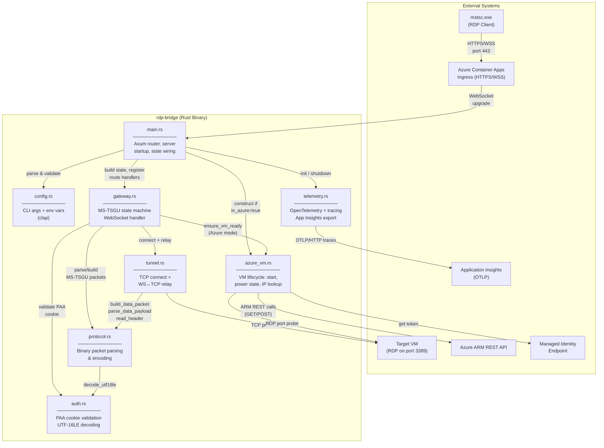

# RDP Bridge — Component Diagram

## Internal Architecture

The rdp-bridge is a Rust/Axum application implementing the MS-TSGU (RD Gateway HTTP transport) protocol. The diagram below shows the internal modules and their dependencies.

## Module Responsibilities

| Module | Responsibility |
|--------|---------------|
| **main.rs** | Entry point. Parses config, initializes telemetry, constructs `GatewayState` (with optional `AzureVmManager`), wires Axum routes (`/health`, `/remoteDesktopGateway/`), runs the HTTP server. |
| **config.rs** | Defines `Config` struct with clap derive. Reads CLI flags and env vars (e.g., `RDP_BRIDGE_IN_AZURE`, `AZURE_SUBSCRIPTION_ID`). Validates required fields based on mode. |
| **gateway.rs** | Core MS-TSGU state machine. Handles WebSocket upgrade, runs the 5-phase handshake (Handshake → TunnelCreate → TunnelAuth → ChannelCreate → DataRelay). Orchestrates auth, Azure VM readiness, and tunnel setup. |
| **protocol.rs** | Binary packet codec for MS-TSGU. Defines packet types, constants, and header format (8 bytes: u16 type + u16 reserved + u32 length). Provides `parse_*` and `build_*` functions for each message type. All encoding is little-endian. |
| **tunnel.rs** | TCP connection and bidirectional relay. `connect()` opens a TCP socket to the target. `relay_ws()` runs a `tokio::select!` loop forwarding data between WebSocket and TCP, handling keepalives and close-channel. |
| **auth.rs** | PAA cookie validation. Decodes UTF-16LE strings. Validates cookie against configured username (case-insensitive substring match). Returns `true` if no username is configured (open access). |
| **azure_vm.rs** | Azure VM lifecycle manager. Acquires tokens via managed identity (or Azure CLI fallback). Calls ARM API to check power state, start VMs, resolve private IPs via NIC metadata, and probe RDP port reachability. |
| **telemetry.rs** | OpenTelemetry initialization. Parses `APPLICATIONINSIGHTS_CONNECTION_STRING`, configures OTLP HTTP exporter with `x-ms-ikey` header, installs tracing subscriber layers. Falls back to console-only tracing. |

## Key Types

| Type | Module | Description |
|------|--------|-------------|
| `Config` | config.rs | All runtime configuration (clap-derived) |
| `GatewayState` | gateway.rs | Shared state: holds `Config` + optional `AzureVmManager` |
| `PacketHeader` | protocol.rs | 8-byte MS-TSGU header (type, reserved, length) |
| `HandshakeRequest` | protocol.rs | Client handshake: major/minor version, extended auth flags |
| `TunnelCreateRequest` | protocol.rs | Tunnel capabilities, fields present flags, PAA cookie |
| `ChannelCreateRequest` | protocol.rs | Target server name + port |
| `AzureVmManager` | azure_vm.rs | Holds subscription ID, resource group, HTTP client, token cache |
| `PowerState` | azure_vm.rs | Enum: Running, Starting, Deallocated, Deallocating, Stopped, Unknown |
| `AzureVmError` | azure_vm.rs | Error enum: Token, Api, Timeout |
