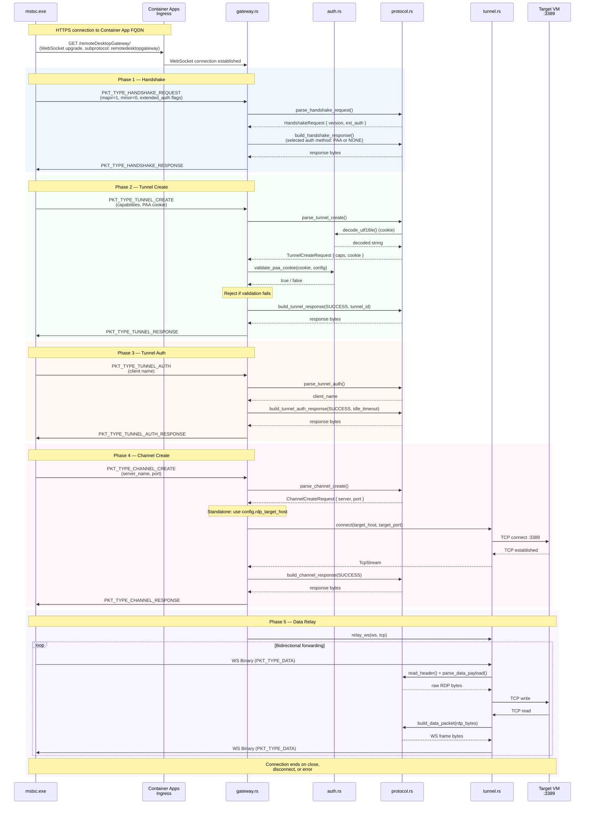
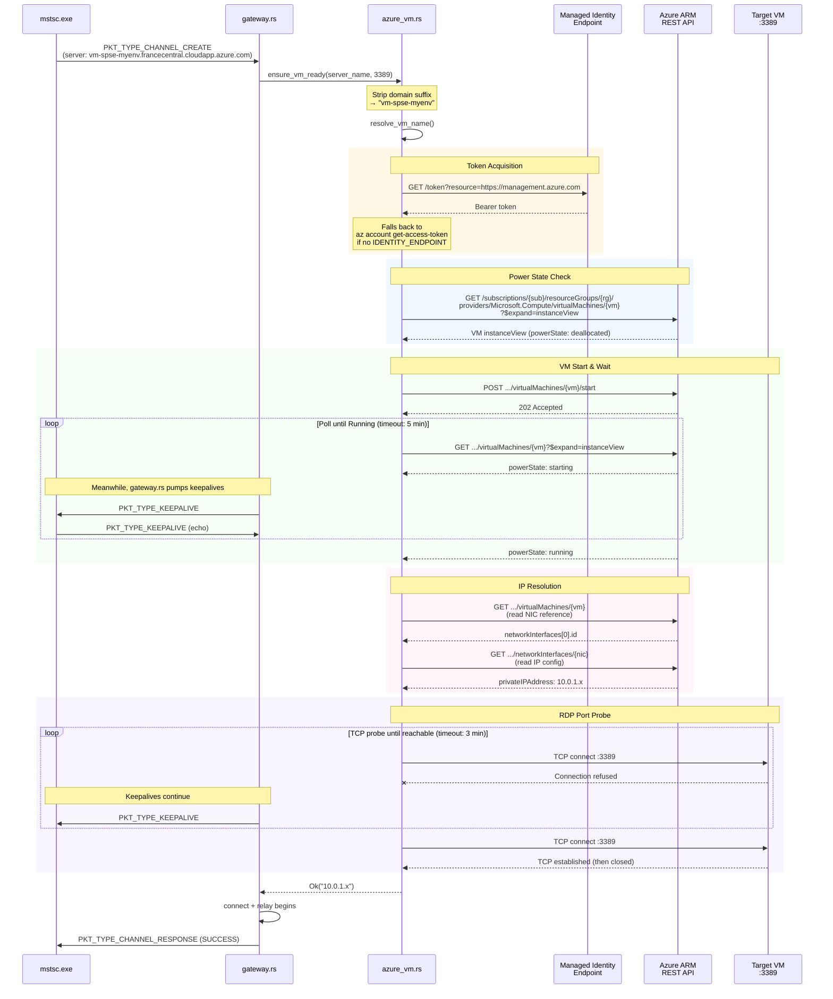
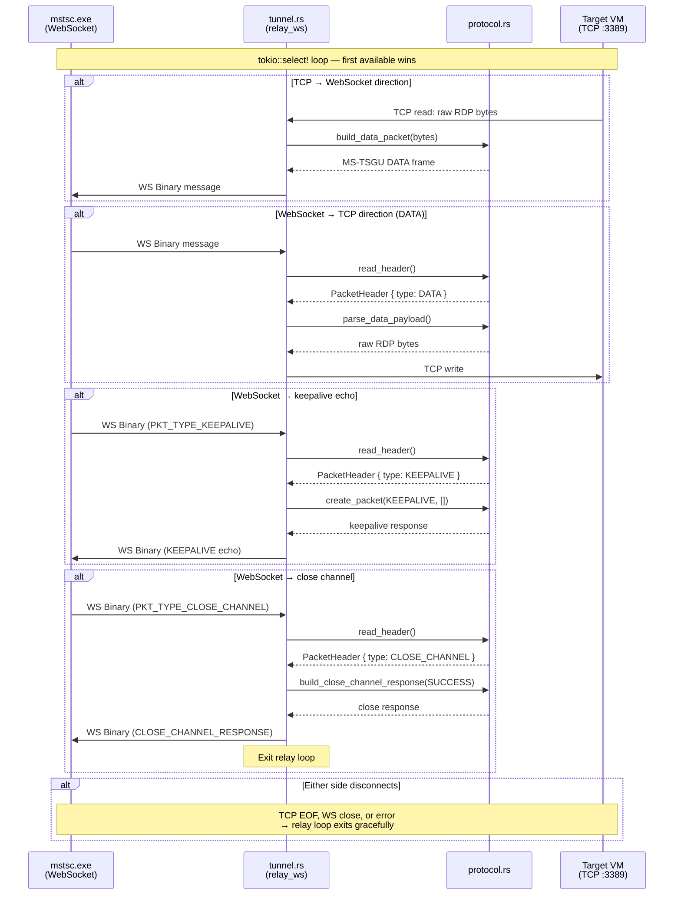

# RDP Bridge — Sequence Diagrams

## 1. MS-TSGU Handshake (Standalone Mode)

The full WebSocket-based RD Gateway connection from client to data relay, when `in_azure=false` (standalone mode with a fixed target host).

## 2. Azure VM Lifecycle (Azure Mode)

When `in_azure=true`, the ChannelCreate phase triggers VM lifecycle management before establishing the TCP tunnel. This diagram shows the `ensure_vm_ready()` flow in `azure_vm.rs`, including keepalive pumping from `gateway.rs`.

## 3. Data Relay — Bidirectional Forwarding

Detail of `tunnel::relay_ws()` showing how WebSocket frames and TCP bytes are forwarded, including keepalive and close-channel handling.

